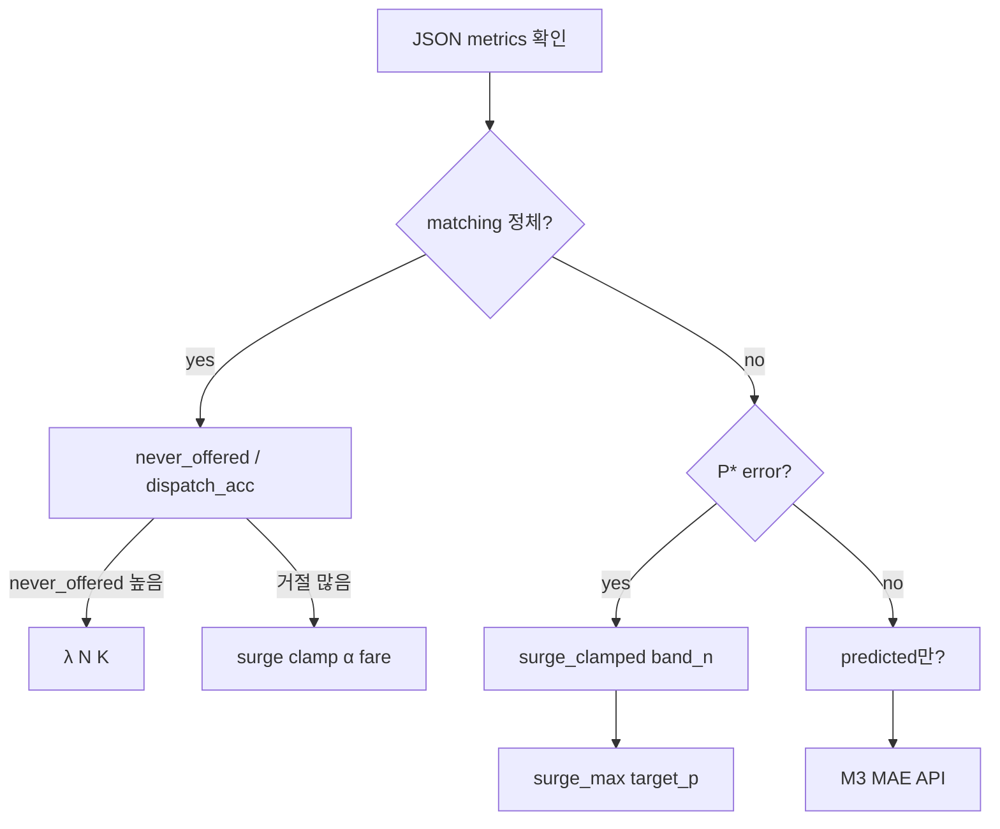

# Module 4 알고리즘 트러블슈팅

**작성일:** 2026-06-02  
**대상:** PU 역산 fare · nearest 배차 · predicted/actual 수요 · 구간 P\*  
**연관:** [`2026-06-01-issues-and-resolutions.md`](./2026-06-01-issues-and-resolutions.md), [`../2026-06-01-simulation-tuning-plan.md`](../2026-06-01-simulation-tuning-plan.md), [`../sumo_service/README.experiment.v2-surge.md`](../sumo_service/README.experiment.v2-surge.md), [`2026-06-02-experiment-metrics-and-comparison.md`](./2026-06-02-experiment-metrics-and-comparison.md)

---

## 0. 알고리즘 한 줄 (정상 동작 시)

```text
H3 수요/공급 → raw_surge → 구간별 P* → required_fare (역산)
  → calculated_surge → final_surge (cap·반올림) → 기사 수락 확률
빈 택시 ↔ waiting 승객: nearest + pool K → changeTarget → pickup → trip
```

| 레이어 | 코드 | 실험에서 바꾸는 축 |
|--------|------|-------------------|
| 수요 | `demand_source` actual / predicted | Module3 `/predict` |
| 가격 | inverse pricing (`simulation._dispatch_pricing`) | α, `surge_max`, `target_p`, `band_incentive_usd` |
| 배차 | nearest, `dispatch_max_candidates` | K, rebalance |
| 과부하 | `passenger_lambda`, `N_TAXIS` | ratio 3.5~5.5:1 |

---

## 1. 증상 → 원인 → 조치 (빠른 표)

| 증상 | 먼저 볼 KPI | 흔한 원인 | 조치 |
|------|-------------|-----------|------|
| **α 올려도 matching ~0.6 정체** | `never_offered`, `dispatch_acceptance` | λ 과부하 (offer 부족) | λ↓ 또는 N↑; α는 P\*용 |
| **error 개선, matching 안 올라감** | 위 + `band_*_dispatch_n` | 제안 수락률 ≠ 스폰 매칭률 | §2 KPI 혼동; λ 조절 |
| **P\* error 항상 음수 (고서지)** | `surge_clamped_rate`, `avg_final_surge` | cap 4.9에 역산 상한 | `surge_max` 6.0 sweep; P\* 그리드 |
| **surge_clamped_rate ≈ 1** | `calculated_surge` vs `final_surge` | 동일 | cap 완화·고서지 P\*만 올리기 |
| **중간 구간 P\* 표본 0** | `band_raw_lt_*_dispatch_n` | 배차가 고서지에만 몰림 | 정상에 가까움; 고서지 band만 해석 |
| **rebalance만 이상** | `rebalance_redirect_count` | (과거) 역산 꺼짐 버그 | 최신 코드: 실험 모드 항상 역산 |
| **predicted만 악화** | `module3_horizon_mae_avg` | 예측 bias·stale | M3 검증 run; actual A/B |
| **rebalance + AI 악화** | 14k A/B Δmatch | 예측 수요 + 공급 이동 충돌 | 메인 정책은 `matching` |
| **sim이 현실보다 느림** | Docker CPU, step 로그 | TraCI·findRoute·event_log | §5 벤치 env (ED 유지) |
| **waiting 폭증·step 멈춤** | `avg_dispatch_decisions_per_passenger` | 연쇄 거절 + findRoute | §4 쿨다운·블랙리스트 |
| **P\* 스윕이 반영 안 됨** | JSON `target_p` | (과거) override 미적용 | `ExperimentConfig.target_p` + CLI |
| **6 run인데 컨테이너 3개** | sweep 로그 `jobs=` | 병렬 상한 | `--jobs 6` (RAM 여유 시) |

---

## 2. KPI 혼동 (가장 많은 오해)

### 2.1 두 종류의 “매칭률”

| 지표 | 분모 | 의미 | 튜닝 레버 |
|------|------|------|-----------|
| **`matching_success_rate`** | 스폰된 승객 전체 | 1회라도 수락됐는가 | λ, K, 공급·배차 pool |
| **`avg_matching_rate_error`** | **배차 제안이 있었던** 건 | p_actual − P\* (역산 추적) | α, cap, `target_p` |

**판단 규칙:** error만 좋아지고 matching이 정체면 → **과부하 또는 offer 부족**이지 역산 “실패”가 아닐 수 있음.

### 2.2 진단 KPI (plateau 원인 분리)

| KPI | 해석 |
|-----|------|
| `passengers_never_offered_rate` ↑ | 택시가 승객에게 **한 번도** 안 붙음 → λ/N/K |
| `dispatch_acceptance_rate` ↓ | 제안은 있는데 **거절** 많음 → fare·surge·α |
| `surge_clamped_rate` → 1 | 역산 surge가 **cap에 걸림** → `surge_max` |
| `avg_dispatch_decisions_per_passenger` ↑ | pool·연쇄 시도 (성능·ED 모두) |

### 2.3 Module3 vs 정책 KPI

| 지표 | 쓰임 |
|------|------|
| `module3_horizon_mae_avg` | t 예측 vs t+15min **실제** (축 2 검증) |
| `avg_demand_bias` | surge용 **동시점** 비교 — horizon MAE와 **다름** |

---

## 3. 가격·역산 (inverse pricing)

### 3.1 정상 파이프라인

[`README.experiment.v2-surge.md`](../sumo_service/README.experiment.v2-surge.md) 참고.

| 단계 | 실패 시 징후 |
|------|----------------|
| `raw_surge = (D/S)^(1/|e|)` | predicted 수요 틀리면 surge 전체 어긋남 |
| `get_target_matching_rate(raw_surge)` | 계단 구간(1.5/2.5/3.5) 경계에서 fare 급변 |
| `inverse → required_fare` | α↑ → error↓ 가능, matching 무관 |
| `final_surge = clamp(round(calculated))` | **clamp 100%** → P\* 추적 불가 |

**기본 구간 P\*** (`simulation.RAW_SURGE_BUCKETS`):

| raw_surge | P\* |
|---:|---:|
| < 1.5 | 55% |
| < 2.5 | 70% |
| < 3.5 | 80% |
| ≥ 3.5 | 85% |

**스윕 override:** `--target-p 0.90 --target-p-bucket raw_gte_3_5` 또는 `run_pstar_grid_sweep.py`.

### 3.2 surge cap (미해결·실험 중)

- **증상:** 스크리닝 전 run `surge_clamped_rate = 1.0`; 고서지 `band_raw_gte_3_5_p_error` < 0.
- **원인:** `calculated_surge` > `surge_max`(기본 4.9) → `final_surge` 왜곡.
- **조치:** P\* 2×2 그리드 cap 4.9 vs 6.0; 논문은 운영 4.9 + 완화 민감도 병기.

### 3.3 구조적 한계 (열린 이슈)

**fare는 pool 평균 feature, 수락은 개별 택시 feature** (`tuning-plan` §3.3).

| 관측 | 의미 |
|------|------|
| required fare는 맞는데 p_actual ≠ P\* | pool–개별 불일치 |
| β_F ≈ 0 (`docs/기사의사결정 진행방식 설명.txt`) | fare 레버 약함 → surge·인센티브 의존 |

**로드맵:** pool 대표 = 최근접 택시 (옵션 A) 또는 연속 P\*(s) (Phase F).

### 3.4 rebalance + 역산

- **과거 버그:** `use_inverse = (policy_mode == "matching")` → rebalance에서 역산 OFF.
- **현재:** `experiment_config is not None` 이면 **항상 역산** + rebalance는 빈차 이동만 추가.

---

## 4. 배차·연쇄 거절 (ED)

### 4.1 설계 의도

- 승객은 `waiting` 유지 → **다른 택시**가 순차 시도 가능 (현실 ED).
- **제거한 것:** 동일 (택시, 승객) 쌍의 **무한 재시도** + step마다 findRoute 폭주.

### 4.2 증상: TraCI 느려짐·waiting 폭증

| 원인 | 완화 (bench, ED 유지) | env |
|------|------------------------|-----|
| dispatch_decision 이벤트 무한 누적 | fast: O(1) 카운터 | `EXPERIMENT_FAST=1` |
| 거절 직후 같은 쌍 재offer | pair 블랙리스트 | `_rejected_dispatch_pairs` |
| 같은 택시 연속 제안 | 택시 쿨다운 | `TAXI_DISPATCH_COOLDOWN_S=5` |
| 쌍 단위 재시도 간격 | | `PAIR_DISPATCH_COOLDOWN_S=60` |
| findRoute 폭주 | step당 상한 | `BENCH_MAX_FIND_ROUTE_PER_STEP=600` |
| O(T×W) 전수 스캔 | H3 ring 필터 | `DISPATCH_H3_K_RING=1` |
| 먼 택시 route | 직선거리 cutoff | `PICKUP_MAX_EUCLIDEAN_MILES=2.14` |
| 장기 waiting | 이탈 (KPI 영향 있음) | `PASSENGER_WAIT_ABANDON_S=900` (0=off) |

**strict KPI 재현:** `PASSENGER_WAIT_ABANDON_S=0`, `BENCH_STEP_LENGTH=1`, `--jobs 1`.

### 4.3 pool K (`dispatch_max_candidates`)

- K↑ → 거절·시도 수↑ → **matching 소폭↑ 가능**, CPU↑.
- `fair_dispatch10` (K=10) vs `fair_ratio35` (기본) — sweep·14k에서 fair 후보로 분리 검증.

---

## 5. 수요·과부하

### 5.1 λ ↔ 승객:택시 (N=300)

```text
PASSENGER_LAMBDA = round(N_TAXIS × ratio / 12)   # spawn every 5 sim-min
```

| ratio | λ |
|---:|---:|
| 5.5:1 | 138 |
| 4.0:1 | 100 |
| 3.5:1 | 88 |

### 5.2 “5.5:1이 비현실적”

- TLC 데이터: **운행 택시 1대당** ~5.45:1 — 데이터는 현실적.
- 시뮬: **N=300** 으로 스케일 다운 → **의도적 스트레스** (`B_stress_55`).
- 발표: Peak 1.2~1.5:1 + stress 5.5:1 **대조**.

### 5.3 actual vs predicted

| arm | 수요 | AI |
|-----|------|-----|
| actual | parquet OD | 없음 |
| predicted | Module3 surge 입력 | 있음 |

**트러블:** predicted만 나쁨 → M3 MAE·API 실패율 확인; rebalance+predicted는 14k에서 matching 악화 사례.

---

## 6. 벤치 vs fidelity (성능)

**원칙:** ED·K·역산·수요 로직은 동일; TraCI·I/O만 축소.

| 항목 | fast bench | fidelity |
|------|------------|----------|
| step | `BENCH_STEP_LENGTH=2` | 1 |
| 배경차 | `N_BACKGROUND_CARS=200` | 200~1200 |
| WS snapshot | 생략/축소 | full |
| event_log | dispatch O(1) | full log |

**주의:** Docker에 `N_BACKGROUND_CARS=200` 안 넣으면 예전처럼 1200대로 느려질 수 있음.

---

## 7. 실험·코드 함정 (해결됨)

| 문제 | 증상 | 해결 |
|------|------|------|
| `target_p` 무시 | P\* 스윕 무효 | `_apply_experiment_overrides()` + `run_acceptance_experiment --target-p` |
| rebalance 역산 OFF | imb 시나리오 fare 이상 | 실험 모드 항상 inverse |
| `PASSENGER_LAMBDA` import 고정 | sweep마다 rebuild | `ExperimentConfig.passenger_lambda` |
| predicted orchestrator | Module3 HTTP 실패 | host `pip install httpx`; Docker run 내 install |
| parallel cleanup | 다른 arm 컨테이너 kill | `--skip-cleanup` |

---

## 8. 트러블슈팅 순서 (권장)



1. `status=ok` 인지, `spawned_passengers` 규모 확인.  
2. **matching** → λ, never_offered, K.  
3. **P\*** → clamp, `band_*_dispatch_n`, `target_p` 적용 여부.  
4. **predicted** → API·MAE.  
5. **느림** → bench env·연쇄거절 env (§4).

---

## 9. 열린 이슈 (알고리즘)

| 우선 | 이슈 | 상태 |
|:---:|------|------|
| 1 | cap 4.9 → 역산·P\* 왜곡 | P\* 2×2 그리드 진행 |
| 2 | pool 평균 vs 개별 택시 | 설계 검토 (§3.3) |
| 3 | 계단식 구간 P\* | 연속 P\* Phase F |
| 4 | REST Lab ≠ experiment inverse | §3.2 tuning-plan |
| 5 | `imb_combo` predicted 14k | run 완료 후 A/B |

---

## 10. 관련 파일

| 영역 | 경로 |
|------|------|
| 역산·배차·쿨다운 | `sumo_service/app/simulation.py` |
| 구간 KPI | `sumo_service/app/experiment_metrics.py` |
| rebalance | `sumo_service/app/rebalance.py` |
| P\* override 테스트 | `sumo_service/tests/test_experiment_target_p.py` |
| P\* 12 run | `sumo_service/scripts/run_pstar_grid_sweep.py` |
| 시나리오·score | `sumo_service/scripts/screening_scenarios.py` |

---

## 11. 최종 정책 선정 (요약)

상세: [`2026-06-02-experiment-metrics-and-comparison.md`](./2026-06-02-experiment-metrics-and-comparison.md) §7.

- **알고리즘:** predicted + matching + PU 역산 (imb_rebalance/combo는 메인 후보 아님).  
- **환경:** fair_ratio35 (튜닝), fair_ratio40 (4:1), B_stress_55 (한계).  
- **P\***: 고서지 bucket 스윕 후 확정.
